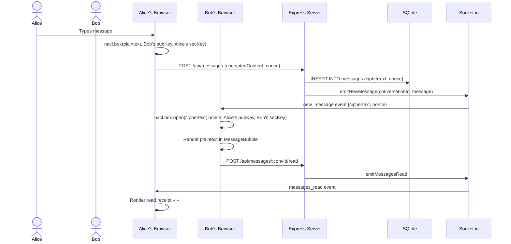
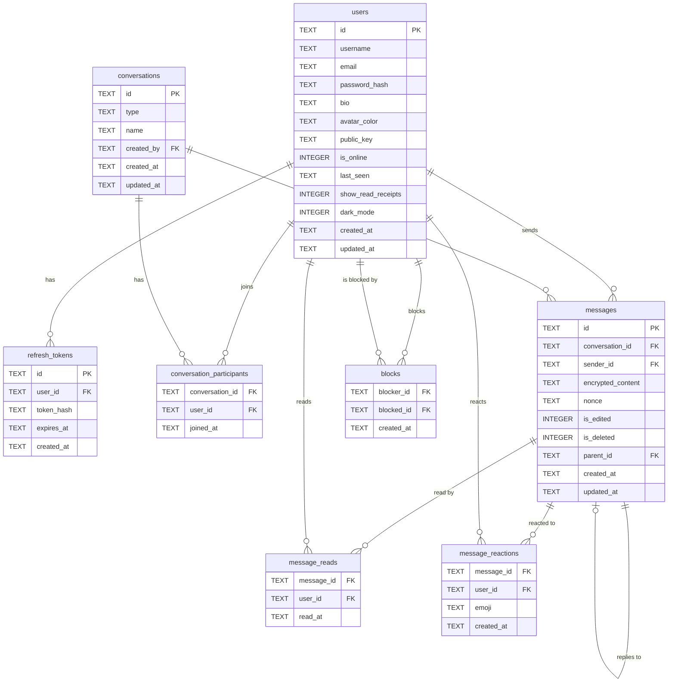
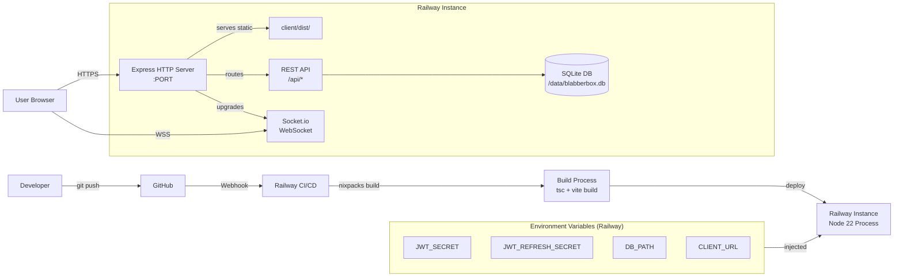

# Blabberbox

> **Where gossip meets encryption.**
> Enterprise-level technical documentation for software engineers, researchers, and employers.

[](https://react.dev)
[](https://www.typescriptlang.org)
[](https://expressjs.com)
[](https://socket.io)
[](https://sqlite.org)
[](https://railway.app)

---

## Table of Contents

1. [Executive Summary](#1-executive-summary)
2. [System Overview](#2-system-overview)
3. [Functional Overview](#3-functional-overview)
4. [Technology Stack](#4-technology-stack)
5. [Repository Structure](#5-repository-structure)
6. [Software Architecture](#6-software-architecture)
7. [Component Documentation](#7-component-documentation)
8. [Workflow](#8-workflow)
9. [Installation Guide](#9-installation-guide)
10. [Configuration](#10-configuration)
11. [Environment Variables](#11-environment-variables)
12. [Build Process](#12-build-process)
13. [Deployment](#13-deployment)
14. [Security Features](#14-security-features)
15. [Error Handling](#15-error-handling)
16. [Performance Considerations](#16-performance-considerations)
17. [Scalability](#17-scalability)
18. [Limitations](#18-limitations)
19. [Future Improvements](#19-future-improvements)
20. [API Documentation](#20-api-documentation)
21. [Database Documentation](#21-database-documentation)
22. [Folder-by-Folder Explanation](#22-folder-by-folder-explanation)
23. [Code Flow](#23-code-flow)
24. [Sequence Diagram](#24-sequence-diagram)
25. [Architecture Diagram](#25-architecture-diagram)
26. [ER Diagram](#26-er-diagram)
27. [Deployment Diagram](#27-deployment-diagram)
28. [Conclusion](#28-conclusion)

---

## 1. Executive Summary

### Purpose

Blabberbox is a **full-stack, end-to-end encrypted real-time chat application** built as a monorepo. It enables users to exchange messages that are cryptographically encrypted on the client before transmission, meaning the server never sees plaintext content.

### Problem Statement

Most consumer chat applications store messages in plaintext or use transport-only encryption (TLS), leaving messages readable by the service provider. Blabberbox addresses this by implementing **client-side NaCl box encryption** for direct messages and **NaCl secretbox encryption** for group chats, ensuring zero-knowledge storage on the server.

### Objectives

| # | Objective |
|---|-----------|
| 1 | Provide real-time direct messaging and group chat with sub-second delivery via Socket.io |
| 2 | Ensure end-to-end encryption so the server stores only ciphertext blobs |
| 3 | Implement a secure JWT authentication system with short-lived access tokens and rotating refresh tokens |
| 4 | Support social features: emoji reactions, threaded replies, read receipts, typing indicators, and user blocking |
| 5 | Deploy as a single unified service on Railway with SQLite persistent storage |

---

## 2. System Overview

Blabberbox is a **monorepo** containing two independent applications that communicate over HTTP and WebSocket:

- **`client/`** — A Vite + React 18 SPA. Handles all UI, state management (Zustand), and cryptographic operations (TweetNaCl). Communicates with the server via a REST API and a persistent Socket.io connection.
- **`server/`** — An Express + Node.js 22 API server. Manages authentication, conversation/message CRUD, Socket.io event broadcasting, and SQLite persistence. It is **encryption-agnostic**: it stores whatever ciphertext the client sends without any ability to decrypt it.

In production, Express serves the compiled React bundle as static files, making the whole system a single deployable process.

---

## 3. Functional Overview

| Feature | Description |
|---------|-------------|
| Registration / Login | Email + password auth; bcrypt hashing; JWT access + refresh tokens |
| Direct Messages | One-to-one encrypted conversations using NaCl box (asymmetric) |
| Group Chats | Multi-party encrypted conversations using NaCl secretbox (symmetric shared key) |
| Real-time Delivery | Socket.io rooms; instant message push to all participants |
| Message Editing | Edit own messages (ciphertext + nonce replaced; `is_edited` flagged) |
| Message Deletion | Soft delete; ciphertext cleared server-side; rendered as `[unsaid 💨]` |
| Emoji Reactions | Per-message, per-user emoji toggle; real-time broadcast |
| Threaded Replies | `parent_id` on messages; reply preview in message bubble |
| Read Receipts | Per-message read tracking; double-tick rendering; togglable in profile |
| Typing Indicators | Socket events with 3-second debounce; humorous copy |
| User Blocking | Blocks hide users from search and prevent new DM creation |
| Online Presence | `is_online` flag toggled on connect/disconnect; broadcasted via socket |
| Dark / Light Mode | Persisted per-user preference; `data-theme` attribute on document root |
| Profile Settings | Bio, avatar colour, read-receipt toggle, public key display |
| Unread Counts | Per-conversation badge; cleared on viewing conversation |

---

## 4. Technology Stack

### Frontend (`client/`)

| Technology | Version | Role |
|-----------|---------|------|
| React | `^18.2.0` | UI rendering |
| React DOM | `^18.2.0` | DOM binding |
| React Router DOM | `^6.21.3` | Client-side routing (`/auth`, `/`, `/c/:id`) |
| TypeScript | `^5.3.3` | Type safety across all source files |
| Vite | `^5.0.11` | Dev server and production bundler |
| Zustand | `^4.5.0` | Global state management (auth, chat, UI stores) |
| Socket.io Client | `^4.7.4` | WebSocket communication with server |
| TweetNaCl | `^1.0.3` | NaCl box + secretbox cryptography |
| TweetNaCl-util | `^0.15.1` | Base64 encoding helpers for NaCl |

### Backend (`server/`)

| Technology | Version | Role |
|-----------|---------|------|
| Node.js | `>=22.0.0` | Runtime (uses native `DatabaseSync`) |
| Express | `^4.18.2` | HTTP server and routing |
| Socket.io | `^4.7.4` | Real-time bidirectional WebSocket server |
| SQLite (native) | Node 22 built-in | Persistent relational database |
| jsonwebtoken | `^9.0.2` | JWT signing and verification |
| bcryptjs | `^2.4.3` | Password hashing (12 rounds) |
| uuid | `^9.0.1` | UUID v4 generation for all entity IDs |
| cors | `^2.8.5` | Cross-origin resource sharing |
| helmet | `^7.1.0` | HTTP security headers |
| express-rate-limit | `^7.1.5` | API and auth rate limiting |
| dotenv | `^16.4.1` | `.env` file loading |
| TypeScript | `^5.3.3` | Type safety |
| ts-node-dev | `^2.0.0` | Development hot-reload runner |

### Infrastructure

| Service | Role |
|---------|------|
| Railway | Cloud hosting; Nixpacks builder; persistent volume for SQLite |

---

## 5. Repository Structure

```
blabberbox/
│
├── client/                          # React SPA frontend
│   ├── index.html                   # HTML entry point (favicon, root div)
│   ├── vite.config.ts               # Vite config: React plugin, path alias, API proxy
│   ├── tsconfig.json                # TS config: ES2020, strict, @/* alias
│   ├── package.json                 # Frontend dependencies
│   └── src/
│       ├── main.tsx                 # React StrictMode app mount
│       ├── App.tsx                  # Router + AppShell + theme management
│       ├── types/
│       │   └── index.ts             # Shared TypeScript interfaces (UserPublic, MessageRecord, etc.)
│       ├── styles/
│       │   └── globals.css          # Full application stylesheet (862 lines)
│       ├── services/
│       │   ├── api.ts               # Centralized REST API client (token refresh, all endpoints)
│       │   ├── crypto.ts            # NaCl encryption/decryption service
│       │   └── socket.ts            # Socket.io client wrapper
│       ├── store/
│       │   ├── authStore.ts         # Zustand: user, tokens, keypair (persisted)
│       │   ├── chatStore.ts         # Zustand: conversations, messages, typing, unread
│       │   └── uiStore.ts           # Zustand: dark mode, modals, search (dark mode persisted)
│       ├── hooks/
│       │   └── useSocket.ts         # Socket lifecycle + event listener management
│       └── components/
│           ├── auth/
│           │   └── AuthPage.tsx     # Login/register tabs with validation
│           ├── layout/
│           │   └── Sidebar.tsx      # Conversation list, search, new DM/group modals
│           ├── chat/
│           │   ├── ChatArea.tsx     # Message list, scroll management, pagination
│           │   ├── MessageBubble.tsx # Individual message render (reactions, actions, receipts)
│           │   ├── MessageInput.tsx  # Compose area: text, emoji picker, reply/edit modes
│           │   └── TypingIndicator.tsx # Animated "is cooking up nonsense" indicator
│           ├── profile/
│           │   └── ProfileModal.tsx  # Settings modal: profile, blocked users, security
│           └── ui/
│               ├── Avatar.tsx        # User avatar with size variants and online dot
│               └── Modal.tsx         # Reusable dialog with overlay and animations
│
├── server/                          # Express + Socket.io backend
│   ├── tsconfig.json                # TS config: CommonJS output, ./dist/
│   ├── package.json                 # Backend dependencies
│   └── src/
│       ├── index.ts                 # Server bootstrap: Express setup, Socket.io, routes
│       ├── types/
│       │   └── index.ts             # Server TypeScript interfaces + toUserPublic converter
│       ├── config/
│       │   ├── env.ts               # Typed environment variable access
│       │   └── database.ts          # SQLite schema init (8 tables, indexes, pragmas)
│       ├── middleware/
│       │   ├── auth.ts              # authenticate + optionalAuth middleware
│       │   └── rateLimiter.ts       # authLimiter, apiLimiter, messageLimiter
│       ├── routes/
│       │   ├── auth.ts              # /api/auth: register, login, refresh, logout, me
│       │   ├── users.ts             # /api/users: search, profile, block/unblock
│       │   ├── conversations.ts     # /api/conversations: list, create DM, create group
│       │   └── messages.ts          # /api/messages: CRUD, reactions, read receipts
│       ├── socket/
│       │   └── handler.ts           # Socket.io event handlers + emit helper functions
│       └── utils/
│           └── helpers.ts           # buildMessageRecord + buildConversationRecord
│
├── .env.example                     # Environment variable template
├── .node-version                    # Node.js version pin: 22
├── railway.json                     # Railway deployment configuration
├── package.json                     # Monorepo root: install + run scripts
└── .gitignore                       # Excludes: node_modules, dist, *.db, .env
```

---

## 6. Software Architecture

### Frontend

The React SPA uses **React Router v6** for client-side routing with three routes:
- `/auth` — Login / register
- `/` — Main chat (sidebar + active conversation)
- `/c/:id` — Deep-link to specific conversation

State is managed by three **Zustand** stores:

| Store | Persisted | Responsibility |
|-------|-----------|----------------|
| `authStore` | Yes (`blabberbox_auth`) | User identity, JWT tokens, NaCl keypair |
| `chatStore` | No | Conversations, messages (decrypted), typing state, unread counts |
| `uiStore` | Partial (`isDarkMode`) | Modal open states, dark mode toggle, search query |

All encryption is performed **client-side before any network call**. The server receives and stores only ciphertext.

### Backend

The Express server is structured as a layered system:

```
Request → Helmet → CORS → Rate Limiter → Auth Middleware → Route Handler → Database → Response
```

Socket.io runs on the same HTTP server instance and authenticates connections via JWT in `socket.handshake.auth.token`. Users are tracked in an in-memory `Map<userId, Set<socketId>>` for multi-device presence detection.

### Database

SQLite is used with the Node.js 22 native `DatabaseSync` API (no ORM). The database file is stored at a configurable path (local: `./blabberbox.db`, Railway: `/data/blabberbox.db`).

**WAL mode** is enabled for concurrent read performance. **Foreign keys** are enforced. All writes use synchronous normal mode.

### Authentication

| Token | Lifetime | Storage |
|-------|----------|---------|
| Access JWT | 15 minutes | Client memory (Zustand) |
| Refresh JWT | 30 days | `localStorage` (Zustand persist) |

Refresh tokens are stored as **SHA-256 hashes** in the database. On use, the hash is validated and the token is single-use (rotation supported). On logout, all refresh tokens for the user are deleted.

### API Layer

All REST endpoints are prefixed `/api/`. Authentication is enforced via the `authenticate` middleware (Bearer token in `Authorization` header). The `optionalAuth` middleware is used where auth is optional.

### Data Flow — Message Send

```
Client encrypts message with NaCl
    │
    ▼
POST /api/messages { conversationId, encryptedContent, nonce }
    │
    ▼
Server stores ciphertext (cannot read content)
    │
    ▼
Server broadcasts new_message via Socket.io to conv:${conversationId} room
    │
    ▼
Other clients receive ciphertext + decrypt with their own private keys
```

### Encryption Model

| Chat Type | Algorithm | Keys |
|-----------|-----------|------|
| Direct Message | NaCl box (asymmetric) | Sender secret key + recipient public key |
| Group Chat | NaCl secretbox (symmetric) | Shared group key (distributed out-of-band) |

Key pairs are generated at registration and stored in the client's `localStorage`. The private key **never leaves the device**. The public key is stored on the server.

---

## 7. Component Documentation

### `App.tsx`

| Attribute | Detail |
|-----------|--------|
| **Purpose** | Root component; router configuration; theme management |
| **Responsibilities** | Defines three routes; reads `isDarkMode` from uiStore; sets `data-theme` on `document.documentElement`; renders AppShell when authenticated |
| **Key Logic** | `ConvRoute` inner component reads `:id` URL param and calls `setActiveConversation` from chatStore on mount |

---

### `AuthPage.tsx`

| Attribute | Detail |
|-----------|--------|
| **Purpose** | Single-page login and registration UI |
| **Responsibilities** | Manages tab state (login vs register); validates all form fields client-side before submission; calls `authStore.login` or `authStore.register` |
| **Validation** | Username: 3–20 chars, `/^[a-zA-Z0-9_]+$/`; Email: format check; Password: ≥8 chars; Confirm: match |
| **Inputs** | None (reads from authStore) |
| **Outputs** | Navigates to `/` on successful auth |

---

### `Sidebar.tsx`

| Attribute | Detail |
|-----------|--------|
| **Purpose** | Left panel showing conversation list and navigation actions |
| **Responsibilities** | Renders all conversations with unread badges; search with debounce; new DM and group modals |
| **Dependencies** | `chatStore`, `authStore`, `uiStore`; `api.ts`; `socket.ts` |
| **Interactions** | Clicking a conversation navigates to `/c/:id`; "Fresh Tea" opens user search for DM; "Squad Session" opens group creation form |

---

### `ChatArea.tsx`

| Attribute | Detail |
|-----------|--------|
| **Purpose** | Main message display and interaction area |
| **Responsibilities** | Renders paginated message list; manages scroll position; joins/leaves Socket.io room; marks messages as read |
| **Pagination** | Loads 50 messages per page; "Load More" button triggers `loadMessages` with `before` timestamp |
| **Interactions** | Passes `replyTo` and `editMessage` state down to `MessageInput`; listens to socket events via `useSocket` hook |

---

### `MessageBubble.tsx`

| Attribute | Detail |
|-----------|--------|
| **Purpose** | Renders a single chat message with all interactive features |
| **Responsibilities** | Displays decrypted content (or fallback text); shows sender info for groups; renders reaction bar; exposes action buttons on hover |
| **Inputs** | `message: MessageRecord`, `isOwn: boolean`, `showAvatar: boolean`, `onReply`, `onEdit`, `onDelete` callbacks |
| **Special States** | Deleted: shows `[unsaid 💨]`; Undecryptable: shows `[encrypted]`; Edited: appends `(edited)` |

---

### `MessageInput.tsx`

| Attribute | Detail |
|-----------|--------|
| **Purpose** | Message composition area |
| **Responsibilities** | Encrypts message before sending; manages edit and reply modes; emits typing socket events with debounce; resizes textarea up to 120px |
| **Encryption** | Calls `cryptoService.encryptMessage` (DM) or `encryptGroupMessage` (group) before `messagesApi.send` |
| **Inputs** | `conversationId`, `replyTo`, `editMessage`, `onCancelEdit`, `onCancelReply` |

---

### `useSocket.ts`

| Attribute | Detail |
|-----------|--------|
| **Purpose** | Custom hook managing the full Socket.io lifecycle |
| **Responsibilities** | Connects on mount (when token available); registers all incoming event listeners; cleans up on unmount |
| **Events handled** | `new_message`, `message_updated`, `message_reaction_updated`, `user_typing`, `user_stopped_typing`, `user_status`, `messages_read` |
| **Side effects** | Auto-marks messages read when viewing active conversation; increments unread for others |

---

### `crypto.ts`

| Attribute | Detail |
|-----------|--------|
| **Purpose** | All cryptographic operations |
| **Functions** | `generateKeyPair()`, `encryptMessage(text, recipientPublicKey, senderSecretKey)`, `decryptMessage(ciphertext, nonce, senderPublicKey, recipientSecretKey)`, `encryptGroupMessage(text, groupKey)`, `decryptGroupMessage(ciphertext, nonce, groupKey)`, `generateGroupKey()` |
| **Encoding** | All keys and ciphertext transmitted as base64 strings via `tweetnacl-util` |

---

### `socket/handler.ts`

| Attribute | Detail |
|-----------|--------|
| **Purpose** | All Socket.io server-side event handling |
| **Responsibilities** | Authenticates connections; tracks user↔socket mapping; handles join/leave/typing/read events; manages online presence |
| **Exports** | `setupSocketHandlers(io)`, `emitNewMessage`, `emitMessageUpdated`, `emitReactionUpdated`, `emitMessagesRead` |
| **Rooms** | `user:${userId}` (per-user), `conv:${conversationId}` (per-conversation) |

---

## 8. Workflow

### Complete Message Send Flow

```
1. User types in MessageInput
        │
        ▼
2. Socket emit: typing_start → Server broadcasts user_typing to other participants
        │
        ▼
3. User presses Enter (or clicks Send)
        │
        ▼
4. MessageInput calls cryptoService.encryptMessage(plaintext, recipientPublicKey, mySecretKey)
   → Returns { encryptedContent: base64, nonce: base64 }
        │
        ▼
5. messagesApi.send({ conversationId, encryptedContent, nonce, parentId? })
   → POST /api/messages
        │
        ▼
6. Server validates: user is participant; message fields present
        │
        ▼
7. Server writes to SQLite: messages table (stores ciphertext, nonce — never plaintext)
        │
        ▼
8. Server calls emitNewMessage(io, conversationId, message)
   → Socket.io broadcasts new_message to conv:${conversationId} room
        │
        ▼
9. All connected participants receive new_message event
        │
        ▼
10. chatStore.addMessage calls decryptMsg:
    - DM: nacl.box.open(ciphertext, nonce, senderPublicKey, mySecretKey)
    - Group: nacl.secretbox.open(ciphertext, nonce, groupKey)
        │
        ▼
11. Decrypted plaintext rendered in MessageBubble
```

---

## 9. Installation Guide

### Prerequisites

| Requirement | Version |
|-------------|---------|
| Node.js | `22.x` (see `.node-version`) |
| npm | `10.x` |
| Git | Any recent version |

### Steps

```bash
# 1. Clone the repository
git clone https://github.com/ainin123/Blabberbox.git
cd Blabberbox

# 2. Install all dependencies (root + client + server)
npm run install:all
# Equivalent to: npm install && cd client && npm install && cd ../server && npm install

# 3. Configure environment variables
cp .env.example .env
# Edit .env with your values (see Environment Variables section)

# 4. Start both client and server in development mode
npm run dev
# Starts: server on :3001 and client Vite on :5173 concurrently
```

Open [http://localhost:5173](http://localhost:5173) in your browser.

---

## 10. Configuration

### Root `package.json` Scripts

| Script | Command | Description |
|--------|---------|-------------|
| `install:all` | Installs root, client, server deps | One-command setup |
| `dev` | Runs client + server concurrently | Development mode |
| `build` | Builds both client and server | Production build |
| `start` | Starts server (serves built client) | Production start |

### `client/vite.config.ts`

```ts
// Dev proxy — forwards API and socket calls to Express server
server: {
  port: 5173,
  proxy: {
    '/api': 'http://localhost:3001',
    '/socket.io': { target: 'http://localhost:3001', ws: true }
  }
}
```

### `server/tsconfig.json`

Compiles to `./dist/` with CommonJS modules (required for Node.js `require`). Source maps enabled for production debugging.

### `railway.json`

```json
{
  "build": { "builder": "NIXPACKS" },
  "deploy": {
    "startCommand": "cd server && npm start",
    "healthcheckPath": "/api/health",
    "restartPolicyType": "ON_FAILURE",
    "restartPolicyMaxRetries": 3
  }
}
```

---

## 11. Environment Variables

| Variable | Required | Default (dev) | Description |
|----------|----------|---------------|-------------|
| `PORT` | No | `3001` | HTTP server port |
| `NODE_ENV` | No | `development` | `development` or `production` |
| `JWT_SECRET` | **Yes** | Weak dev default | Secret for signing access JWTs |
| `JWT_REFRESH_SECRET` | **Yes** | Weak dev default | Secret for signing refresh JWTs |
| `JWT_EXPIRES_IN` | No | `15m` | Access token lifetime |
| `JWT_REFRESH_EXPIRES_IN` | No | `30d` | Refresh token lifetime |
| `DB_PATH` | No | `./blabberbox.db` | SQLite file path (use `/data/blabberbox.db` on Railway) |
| `CLIENT_URL` | No | `http://localhost:5173` | Allowed CORS origin (`*` for Railway) |
| `BCRYPT_ROUNDS` | No | `12` | bcrypt work factor |

> **Security note:** Always use a cryptographically random 64-character string for `JWT_SECRET` and `JWT_REFRESH_SECRET` in production. The dev defaults in `config/env.ts` are deliberately weak.

---

## 12. Build Process

```bash
# Client build (Vite + TypeScript)
cd client && npm run build
# Output: client/dist/ (static HTML/JS/CSS)

# Server build (TypeScript compiler)
cd server && npm run build
# Output: server/dist/ (CommonJS JavaScript)

# In production, Express serves client/dist/ as static files
# and handles client-side routing with a SPA fallback
```

---

## 13. Deployment

### Railway (Primary)

```bash
# Option A: Railway CLI
npm i -g @railway/cli
railway login
railway up

# Option B: GitHub integration (automatic)
# Connect repo in Railway dashboard → deploys on every push to main
```

**Railway requirements:**
- Add all environment variables in Railway project settings
- Attach a persistent volume mounted at `/data` for the SQLite file
- Health check: `GET /api/health` must return `200`

### Self-hosted (Node.js)

```bash
npm run build       # Build client + server
cd server && npm start  # Serves everything on PORT
```

---

## 14. Security Features

| Feature | Implementation |
|---------|---------------|
| **End-to-end encryption** | NaCl box (DM) + secretbox (group) via TweetNaCl; server stores ciphertext only |
| **Password hashing** | bcryptjs with configurable rounds (default 12) |
| **JWT rotation** | Short-lived access tokens (15m); refresh tokens stored as SHA-256 hashes; invalidated on logout |
| **Rate limiting — auth** | 10 requests per 15 min per IP on `/auth/register` and `/auth/login` |
| **Rate limiting — API** | 200 requests per 60 s per IP on all `/api` routes |
| **Rate limiting — messages** | 60 messages per 60 s per user (keyed by `userId`, not IP) |
| **Security headers** | `helmet()` sets `X-Content-Type-Options`, `X-Frame-Options`, `HSTS`, `CSP`, etc. |
| **CORS** | Configured origin allowlist; credentials enabled |
| **User blocking** | Blocked users excluded from search results; cannot initiate new DMs |
| **Input validation** | Username regex, email format, password length enforced server-side |
| **Socket auth** | JWT verified on every socket connection; unauthenticated connections rejected immediately |

---

## 15. Error Handling

### REST API

All route handlers are wrapped in try/catch. Errors return JSON: `{ "error": "<message>" }`. The global Express error handler catches uncaught exceptions with `500` status.

| Scenario | Status | Message |
|----------|--------|---------|
| Missing required fields | `400` | Field-specific message |
| Username/email already exists | `409` | "Username already taken" / "Email already registered" |
| Invalid credentials | `401` | "Wrong password" |
| JWT invalid or expired | `401` | "Unauthorized blabber! Who are you?" |
| Resource not found | `404` | Context-specific message |
| Server/database error | `500` | "Something blew up on our end" |

### WebSocket

Socket connections that fail JWT verification are immediately disconnected. Errors within socket event handlers are caught and do not crash the server process.

### Client

The `api.ts` service intercepts `401` responses and attempts a token refresh before retrying the original request. If refresh fails, the user is logged out automatically.

---

## 16. Performance Considerations

| Area | Approach |
|------|----------|
| **Database** | WAL mode enables concurrent reads; `PRAGMA synchronous = NORMAL` balances durability and write speed |
| **Indexes** | 6 covering indexes on high-frequency query columns (`conversation_id`, `sender_id`, `created_at`, `user_id`) |
| **Pagination** | Messages loaded 50 at a time with cursor-based pagination (`before` timestamp parameter) |
| **Socket rooms** | Messages are broadcast only to `conv:${conversationId}` room members — not to all connected clients |
| **Typing debounce** | `typing_stop` emitted 3 seconds after last keystroke — prevents event flooding |
| **Token validation** | Access token verification is pure JWT (no DB call); only refresh token validation hits the database |
| **Static serving** | In production, React bundle served directly from Express (`express.static`) with no additional proxy layer |

---

## 17. Scalability

The current architecture is appropriate for a single-server deployment. Key scaling constraints:

- **SQLite** is single-writer by nature; high write concurrency would require migrating to PostgreSQL or MySQL.
- **Socket.io** in-memory room management and the `userSockets` Map are per-process — horizontal scaling across multiple Node.js processes would require a Redis adapter (`socket.io-redis`).
- **JWT verification** is stateless and scales horizontally without shared state.
- **bcrypt** is intentionally slow (rounds = 12); auth endpoints already rate-limited to absorb this cost.

---

## 18. Limitations

| Limitation | Detail |
|------------|--------|
| **SQLite single-writer** | Not suitable for high-concurrency write workloads without migration to a client-server RDBMS |
| **Group key distribution** | Group encryption key management is not fully specified in the codebase; group keys must be distributed securely among participants |
| **No file/media sharing** | Only text messages are supported; no image, video, or file upload capability |
| **No push notifications** | Messages only delivered while client tab is open; no service worker or FCM integration |
| **No message search** | No full-text search across message history (SQLite FTS5 not implemented) |
| **No email verification** | Users can register with any email format without verification |
| **Single Railway instance** | SQLite on a single Railway service is not highly available |
| **No key recovery** | If a user loses their private key (clears localStorage), all past DMs become permanently undecryptable |

---

## 19. Future Improvements

| Priority | Improvement |
|----------|-------------|
| High | Migrate from SQLite to PostgreSQL for horizontal scaling |
| High | Implement group key exchange protocol (e.g., Signal's Sender Keys) |
| High | Add email verification on registration |
| Medium | Socket.io Redis adapter for multi-instance deployments |
| Medium | File and image attachment support with server-side encrypted storage |
| Medium | Push notifications via Web Push API / service worker |
| Medium | Full-text message search using SQLite FTS5 or Meilisearch |
| Low | Private key backup and recovery via passphrase-encrypted export |
| Low | End-to-end tests (Playwright) for auth and messaging flows |
| Low | Message forwarding and starred messages |

---

## 20. API Documentation

All endpoints are prefixed `/api/`. Authenticated endpoints require `Authorization: Bearer <token>` header.

### Authentication — `/api/auth`

#### `POST /api/auth/register`

| Field | Type | Required |
|-------|------|----------|
| `username` | string | Yes (3–20 chars, alphanumeric + `_`) |
| `email` | string | Yes (valid email) |
| `password` | string | Yes (≥8 chars) |
| `publicKey` | string | Yes (base64 NaCl public key) |

**Response `201`:**
```json
{ "token": "...", "refreshToken": "...", "user": { "id": "...", "username": "..." } }
```

---

#### `POST /api/auth/login`

| Field | Type | Required |
|-------|------|----------|
| `email` | string | Yes |
| `password` | string | Yes |

**Response `200`:** Same shape as register.

---

#### `POST /api/auth/refresh`

| Field | Type | Required |
|-------|------|----------|
| `refreshToken` | string | Yes |

**Response `200`:** `{ "token": "..." }`

---

#### `POST /api/auth/logout` *(auth required)*

No body. Deletes all refresh tokens for the user, sets `is_online = 0`.

**Response `200`:** `{ "message": "Logged out successfully" }`

---

#### `GET /api/auth/me` *(auth required)*

**Response `200`:** Current user object.

---

### Users — `/api/users`

#### `GET /api/users/search?q=<term>` *(auth required)*

Returns up to 20 users matching `username LIKE %term%`, excluding current user and blocked users.

---

#### `GET /api/users/blocked` *(auth required)*

Returns list of users blocked by the current user.

---

#### `GET /api/users/:id` *(auth required)*

Returns a single user by ID. `404` if not found.

---

#### `PUT /api/users/profile` *(auth required)*

| Field | Type | Notes |
|-------|------|-------|
| `bio` | string | Max 200 chars |
| `avatarColor` | string | Must match `/#[0-9A-Fa-f]{6}/` |
| `showReadReceipts` | boolean | |
| `darkMode` | boolean | |

---

#### `POST /api/users/:id/block` *(auth required)*

Blocks target user. Idempotent (`INSERT OR IGNORE`).

#### `DELETE /api/users/:id/block` *(auth required)*

Unblocks target user.

---

### Conversations — `/api/conversations`

#### `GET /api/conversations` *(auth required)*

Returns all conversations for current user, ordered by `updated_at DESC`.

#### `POST /api/conversations` *(auth required)* — Create DM

| Field | Type | Required |
|-------|------|----------|
| `participantId` | string | Yes |

Returns existing DM if one already exists between the two users.

#### `GET /api/conversations/:id` *(auth required)*

Returns a single conversation. `403` if user is not a participant.

#### `POST /api/conversations/group` *(auth required)* — Create Group

| Field | Type | Required |
|-------|------|----------|
| `name` | string | Yes (≥2 chars) |
| `participantIds` | string[] | Yes (1–50 users) |

---

### Messages — `/api/messages`

#### `GET /api/messages/:conversationId` *(auth required)*

| Query Param | Default | Max |
|------------|---------|-----|
| `limit` | `50` | `100` |
| `before` | — | ISO timestamp for cursor pagination |

#### `POST /api/messages` *(auth required, messageLimiter)*

| Field | Type | Required |
|-------|------|----------|
| `conversationId` | string | Yes |
| `encryptedContent` | string | Yes (base64 ciphertext) |
| `nonce` | string | Yes (base64 nonce) |
| `parentId` | string | No (for replies) |

**Response `201`:** Full `MessageRecord`.

#### `PUT /api/messages/:id` *(auth required)*

| Field | Type | Required |
|-------|------|----------|
| `encryptedContent` | string | Yes |
| `nonce` | string | Yes |

Sender only. Cannot edit deleted messages.

#### `DELETE /api/messages/:id` *(auth required)*

Soft delete. Sender only. Clears `encrypted_content`; sets `is_deleted = 1`.

#### `POST /api/messages/:id/react` *(auth required)*

| Field | Type | Required |
|-------|------|----------|
| `emoji` | string | Yes |

Toggles reaction. If the same emoji already exists for this user, it is removed.

#### `DELETE /api/messages/:id/react/:emoji` *(auth required)*

Explicitly removes an emoji reaction from the current user.

#### `POST /api/messages/:conversationId/read` *(auth required)*

Marks all unread messages in the conversation as read. Broadcasts `messages_read` event.

#### `GET /api/health`

No auth. Returns `200 { "status": "ok" }`. Used by Railway health checks.

---

### Socket.io Events

#### Client → Server

| Event | Payload | Description |
|-------|---------|-------------|
| `join_conversation` | `{ conversationId }` | Join Socket.io room for conversation |
| `leave_conversation` | `{ conversationId }` | Leave room |
| `typing_start` | `{ conversationId }` | Broadcast typing start to others |
| `typing_stop` | `{ conversationId }` | Broadcast typing stop |
| `mark_read` | `{ conversationId, messageIds[] }` | Mark messages read; broadcast to others |

#### Server → Client

| Event | Payload | Description |
|-------|---------|-------------|
| `new_message` | `MessageRecord` | New message in a conversation |
| `message_updated` | `{ id, encryptedContent, nonce, isEdited, isDeleted, updatedAt }` | Message edited or deleted |
| `message_reaction_updated` | `{ messageId, reactions[] }` | Reaction added or removed |
| `user_typing` | `{ userId, username, conversationId }` | Someone started typing |
| `user_stopped_typing` | `{ userId, conversationId }` | Someone stopped typing |
| `user_status` | `{ userId, isOnline, lastSeen }` | User came online or went offline |
| `messages_read` | `{ conversationId, userId, messageIds[] }` | Messages marked as read by a user |

---

## 21. Database Documentation

**Engine:** SQLite 3 (via Node.js 22 native `DatabaseSync`)
**File:** `blabberbox.db` (path configurable via `DB_PATH`)
**Pragmas:** `journal_mode = WAL`, `foreign_keys = ON`, `synchronous = NORMAL`

### Tables

#### `users`

| Column | Type | Constraints | Description |
|--------|------|-------------|-------------|
| `id` | TEXT | PK | UUID v4 |
| `username` | TEXT | UNIQUE, NOT NULL | 3–20 alphanumeric chars |
| `email` | TEXT | UNIQUE, NOT NULL | User email address |
| `password_hash` | TEXT | NOT NULL | bcrypt hash |
| `bio` | TEXT | DEFAULT `''` | Optional bio (max 200 chars) |
| `avatar_color` | TEXT | DEFAULT `'#FF6B9D'` | Hex colour string |
| `public_key` | TEXT | — | Base64 NaCl public key |
| `is_online` | INTEGER | DEFAULT `0` | Boolean (0/1) |
| `last_seen` | TEXT | — | ISO timestamp |
| `show_read_receipts` | INTEGER | DEFAULT `1` | Boolean (0/1) |
| `dark_mode` | INTEGER | DEFAULT `1` | Boolean (0/1) |
| `created_at` | TEXT | DEFAULT `CURRENT_TIMESTAMP` | |
| `updated_at` | TEXT | DEFAULT `CURRENT_TIMESTAMP` | |

---

#### `refresh_tokens`

| Column | Type | Constraints | Description |
|--------|------|-------------|-------------|
| `id` | TEXT | PK | UUID v4 |
| `user_id` | TEXT | FK → users.id | Token owner |
| `token_hash` | TEXT | NOT NULL | SHA-256 of refresh JWT |
| `expires_at` | TEXT | NOT NULL | ISO expiry timestamp |
| `created_at` | TEXT | DEFAULT `CURRENT_TIMESTAMP` | |

---

#### `conversations`

| Column | Type | Constraints | Description |
|--------|------|-------------|-------------|
| `id` | TEXT | PK | UUID v4 |
| `type` | TEXT | CHECK IN ('direct','group') | Conversation type |
| `name` | TEXT | — | Group name (NULL for DMs) |
| `created_by` | TEXT | FK → users.id | Creator user |
| `created_at` | TEXT | DEFAULT `CURRENT_TIMESTAMP` | |
| `updated_at` | TEXT | DEFAULT `CURRENT_TIMESTAMP` | Updated on new message |

---

#### `conversation_participants`

| Column | Type | Constraints | Description |
|--------|------|-------------|-------------|
| `conversation_id` | TEXT | FK → conversations.id | |
| `user_id` | TEXT | FK → users.id | |
| `joined_at` | TEXT | DEFAULT `CURRENT_TIMESTAMP` | |
| PK | — | (`conversation_id`, `user_id`) | Composite primary key |

---

#### `messages`

| Column | Type | Constraints | Description |
|--------|------|-------------|-------------|
| `id` | TEXT | PK | UUID v4 |
| `conversation_id` | TEXT | FK → conversations.id | |
| `sender_id` | TEXT | FK → users.id | |
| `encrypted_content` | TEXT | — | Base64 NaCl ciphertext |
| `nonce` | TEXT | — | Base64 NaCl nonce |
| `is_edited` | INTEGER | DEFAULT `0` | Boolean (0/1) |
| `is_deleted` | INTEGER | DEFAULT `0` | Soft delete flag |
| `parent_id` | TEXT | FK → messages.id | For threaded replies |
| `created_at` | TEXT | DEFAULT `CURRENT_TIMESTAMP` | |
| `updated_at` | TEXT | DEFAULT `CURRENT_TIMESTAMP` | |

---

#### `message_reads`

| Column | Type | Constraints | Description |
|--------|------|-------------|-------------|
| `message_id` | TEXT | FK → messages.id | |
| `user_id` | TEXT | FK → users.id | Reader |
| `read_at` | TEXT | DEFAULT `CURRENT_TIMESTAMP` | |
| PK | — | (`message_id`, `user_id`) | Composite primary key |

---

#### `message_reactions`

| Column | Type | Constraints | Description |
|--------|------|-------------|-------------|
| `message_id` | TEXT | FK → messages.id | |
| `user_id` | TEXT | FK → users.id | Reactor |
| `emoji` | TEXT | NOT NULL | Emoji character |
| `created_at` | TEXT | DEFAULT `CURRENT_TIMESTAMP` | |
| PK | — | (`message_id`, `user_id`, `emoji`) | Composite primary key |

---

#### `blocks`

| Column | Type | Constraints | Description |
|--------|------|-------------|-------------|
| `blocker_id` | TEXT | FK → users.id | User who blocked |
| `blocked_id` | TEXT | FK → users.id | User who was blocked |
| `created_at` | TEXT | DEFAULT `CURRENT_TIMESTAMP` | |
| PK | — | (`blocker_id`, `blocked_id`) | Composite primary key |

---

### Indexes

| Index | Table | Column(s) | Purpose |
|-------|-------|-----------|---------|
| `idx_messages_conversation_id` | messages | `conversation_id` | Fetch conversation history |
| `idx_messages_sender_id` | messages | `sender_id` | User message lookup |
| `idx_messages_created_at` | messages | `created_at` | Chronological ordering |
| `idx_conv_participants_user_id` | conversation_participants | `user_id` | List user's conversations |
| `idx_message_reads_user_id` | message_reads | `user_id` | Unread count computation |
| `idx_refresh_tokens_user_id` | refresh_tokens | `user_id` | Token lookup on refresh/logout |

---

### Relationships

```
users ──< conversation_participants >── conversations
users ──< messages
messages ──< message_reads >── users
messages ──< message_reactions >── users
messages ──< messages (self-ref: parent_id)
users ──< blocks >── users
users ──< refresh_tokens
```

---

## 22. Folder-by-Folder Explanation

### `client/src/services/`

Three service modules that abstract all external communication:
- **`api.ts`** — Axios-style fetch wrapper; handles token injection, automatic refresh on 401, and consistent error formatting.
- **`crypto.ts`** — Pure functions wrapping TweetNaCl; no side effects; no state.
- **`socket.ts`** — Socket.io client singleton; manages connection lifecycle, room membership, and event emission.

### `client/src/store/`

Three Zustand stores. The separation of concerns is intentional:
- `authStore` is persisted because tokens and keypairs must survive page reloads.
- `chatStore` is not persisted — messages are fetched fresh from the server on load and decrypted in memory.
- `uiStore` persists only `isDarkMode` — modal states are ephemeral.

### `server/src/config/`

- `env.ts` — Single source of truth for all environment variables. Provides typed defaults for development. Every other module imports from here, never reads `process.env` directly.
- `database.ts` — Contains the full DDL (CREATE TABLE + indexes + pragmas) and an `initDatabase()` function called once at server startup.

### `server/src/socket/`

Contains the complete Socket.io server logic. The `emitNew*` functions are exported and called by HTTP route handlers (e.g., when a message is saved via REST, `emitNewMessage` is called to push it to WebSocket clients). This keeps the route handlers thin and the socket logic centralized.

### `server/src/utils/helpers.ts`

Contains two complex query-and-assemble functions:
- `buildMessageRecord(messageId)` — Executes 3 queries (message + reactions + reads) and assembles a complete `MessageRecord`.
- `buildConversationRecord(conversationId, currentUserId)` — Executes 4 queries (conversation + participants + last message + unread count) and assembles a `ConversationRecord`.

These functions are called by both HTTP routes and socket handlers, ensuring consistent data shapes.

---

## 23. Code Flow

### Server Bootstrap

```
node dist/index.js
    │
    ├── dotenv.config() — loads .env
    ├── initDatabase() — creates tables if not exist; sets pragmas
    ├── Express middleware: helmet → cors → json → rateLimiter
    ├── Routes mounted: /api/auth, /api/users, /api/conversations, /api/messages
    ├── Production: serve client/dist + SPA fallback
    ├── http.createServer(app) + io = new Server(httpServer)
    ├── setupSocketHandlers(io)
    └── server.listen(PORT, '0.0.0.0')
```

### Client Bootstrap

```
React.StrictMode mounts App
    │
    ├── authStore.getState() — reads persisted token from localStorage
    ├── Router renders based on /auth vs /
    ├── If authenticated:
    │     AppShell renders: Sidebar + ChatArea + ProfileModal
    │     useSocket() hook fires: socket.connect(token)
    │     chatStore.loadConversations() → GET /api/conversations
    └── If not authenticated:
          AuthPage renders login/register tabs
```

---

## 24. Sequence Diagram



---

## 25. Architecture Diagram

```mermaid
graph TB
    subgraph Client["Client (Vite + React 18)"]
        direction TB
        App[App.tsx<br/>Router]
        App --> Auth[AuthPage]
        App --> Shell[AppShell]
        Shell --> Sidebar
        Shell --> ChatArea
        Shell --> ProfileModal
        ChatArea --> MessageBubble
        ChatArea --> MessageInput
        ChatArea --> TypingIndicator
        subgraph Stores["Zustand Stores"]
            AuthStore[authStore<br/>persisted]
            ChatStore[chatStore]
            UIStore[uiStore<br/>partial persist]
        end
        subgraph Services["Services"]
            API[api.ts]
            Crypto[crypto.ts<br/>TweetNaCl]
            SocketSvc[socket.ts<br/>Socket.io Client]
        end
    end

    subgraph Server["Server (Express + Node 22)"]
        direction TB
        Index[index.ts<br/>Bootstrap]
        Index --> AuthRoute[/api/auth]
        Index --> UsersRoute[/api/users]
        Index --> ConvRoute[/api/conversations]
        Index --> MsgRoute[/api/messages]
        Index --> SocketHandler[socket/handler.ts]
        subgraph Middleware
            Helmet
            CORS
            RateLimit[Rate Limiter]
            AuthMW[auth.ts]
        end
        subgraph DB["SQLite (DatabaseSync)"]
            Users[(users)]
            Messages[(messages)]
            Convs[(conversations)]
            Reactions[(message_reactions)]
            Reads[(message_reads)]
            Blocks[(blocks)]
            Tokens[(refresh_tokens)]
        end
    end

    Client -->|REST: /api/*| Server
    Client -->|WebSocket| SocketHandler
    Server --> DB
```

---

## 26. ER Diagram



---

## 27. Deployment Diagram



---

## 28. Conclusion

Blabberbox is a well-structured, security-conscious full-stack chat application demonstrating several production-grade engineering decisions:

- **Zero-knowledge architecture** — the server is cryptographically incapable of reading message content
- **Clean monorepo layout** — client and server are independently buildable with shared type conventions
- **Layered Express backend** — middleware, routes, socket handlers, and utilities are cleanly separated
- **Principled state management** — three Zustand stores with intentional persistence boundaries
- **Proper refresh token flow** — short-lived access tokens with hashed refresh token rotation

The most significant engineering gaps are the group key distribution protocol (partially implemented at the UI level), the absence of email verification, and the SQLite single-writer constraint — all addressable without architectural rewrites.

---

*Documentation authored for the [`ainin123/Blabberbox`](https://github.com/ainin123/Blabberbox) repository.*
